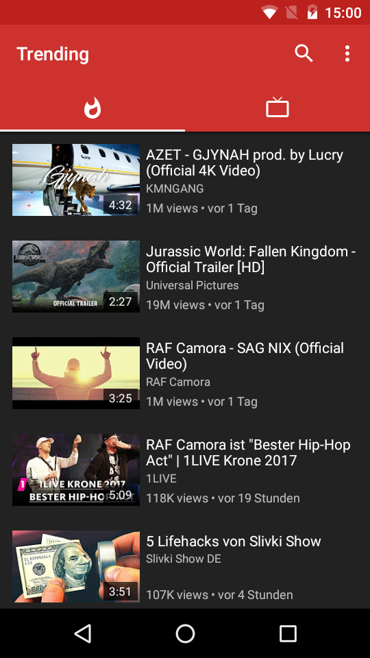
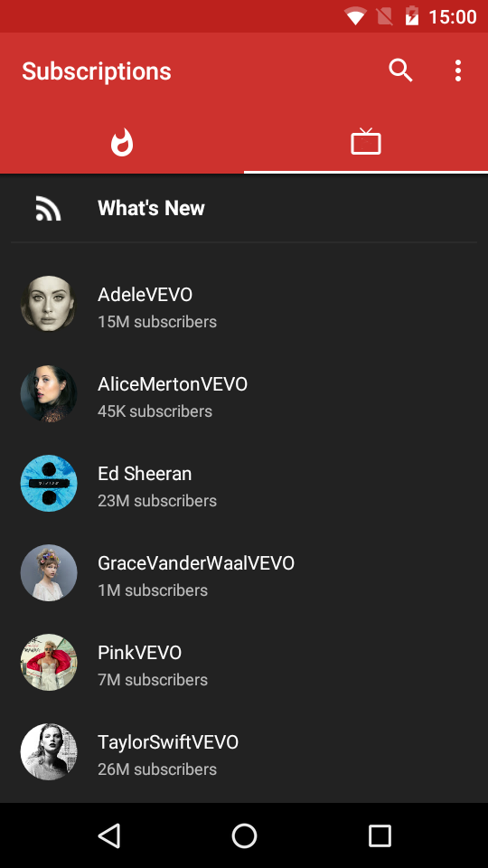
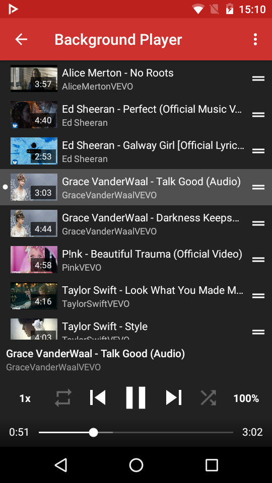
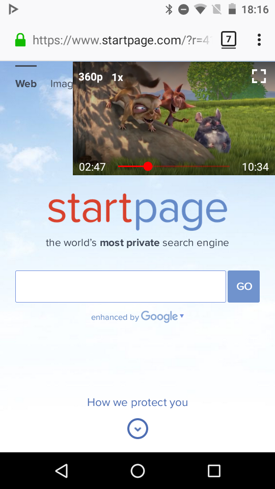
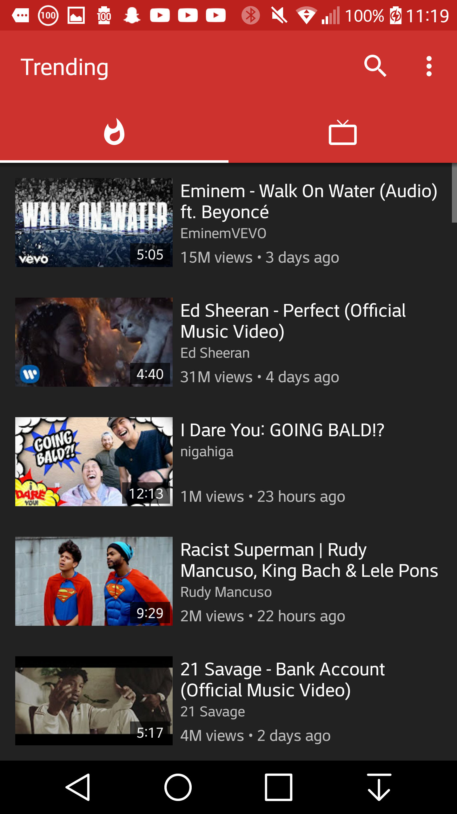
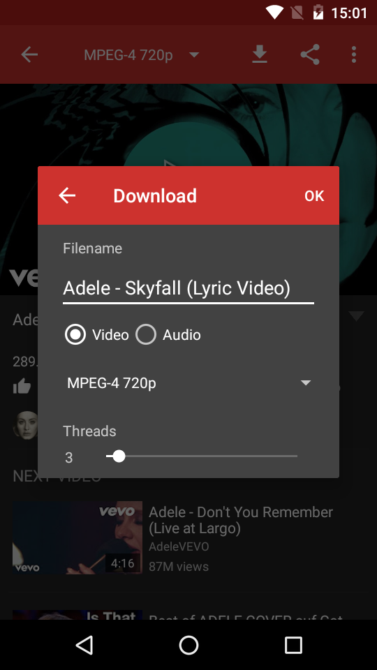
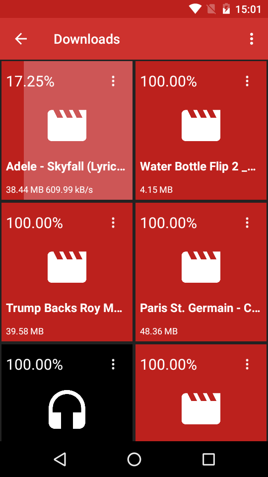

 
<h2 align="center"><b>NewPipe</b></h2>
<h4 align="center">A free lightweight YouTube frontend for Android.</h4>

 

<a href="#screenshots">Screenshots</a> &bull; <a href="#description">Description</a> &bull; <a href="#features">Features</a> &bull; <a href="#contribution">Contribution</a> &bull; <a href="#donate">Donate</a> &bull; <a href="#license">License</a>

<a href="https://newpipe.schabi.org">Website</a> &bull; <a href="https://newpipe.schabi.org/blog/">Blog</a>  &bull; <a href="https://newpipe.schabi.org/press/">Press</a>

WARNING: PUTTING NEWPIPE OR ANY FORK OF IT INTO GOOGLE PLAYSTORE VIOLATES THEIR TERMS OF CONDITIONS.

## Screenshots

## Description

NewPipe does not use any Google framework libraries, or the YouTube API. It only parses the website in order to gain the information it needs. Therefore this app can be used on devices without Google Services installed. Also, you don't need a YouTube account to use NewPipe, and it's FLOSS.

### Features

* Search videos
* Display general information about a video
* Watch YouTube videos
* Listen to YouTube videos
* Popup mode (floating player)
* Select the streaming player to watch the video with
* Download videos 
* Download audio only
* Open a video in Kodi
* Show Next/Related videos
* Search YouTube in a specific language
* Watch/Block age restricted material
* Display general information about channels
* Search channels
* Watch videos from a channel
* Orbot/Tor support (not yet directly)
* 1080p/2k/4k support
* View history
* Subscribe to channels
* Search history
* Search/Watch Playlists
* Watch as queues Playlists
* Queuing videos
* Local playlists
* Subtitles
* Multi-service support (eg. SoundCloud in NewPipe Beta)

### Coming Features

* Livestream support
* Cast to UPnP and Cast
* Show comments
* ... and many more

## Contribution
Whether you have ideas, translations, design changes, code cleaning, or real heavy code changes, help is always welcome.
The more is done the better it gets!

If you'd like to get involved, check our [contribution notes](.github/CONTRIBUTING.md).

## Donate
If you like NewPipe we'd be happy about a donation. You can either donate via Bitcoin, Bountysource or Liberapay. For further information about donating to NewPipe, please visit our [website](https://newpipe.schabi.org/donate).

<table>
  <tr>
    <td></td>
    <td></td>
    <td><samp>16A9J59ahMRqkLSZjhYj33n9j3fMztFxnh</samp></td>
  </tr>
  <tr>
    <td></td>
    <td></td>
    <td></td>
  </tr>
  <tr>
    <td></td>
    <td></td>
    <td></td>
  </tr>
</table>

## License
  

NewPipe is Free Software: You can use, study share and improve it at your
will. Specifically you can redistribute and/or modify it under the terms of the
[GNU General Public License](https://www.gnu.org/licenses/gpl.html) as
published by the Free Software Foundation, either version 3 of the License, or
(at your option) any later version.  
