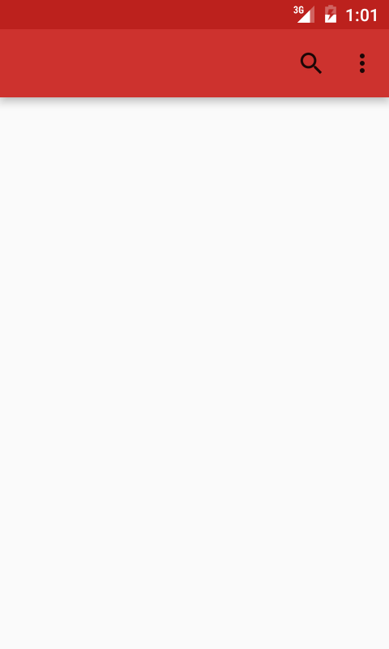
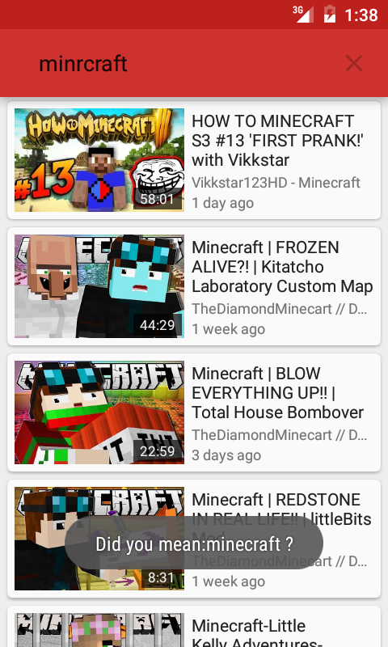
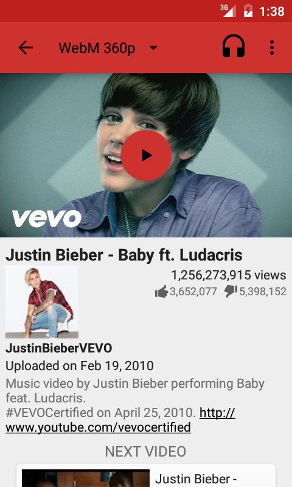
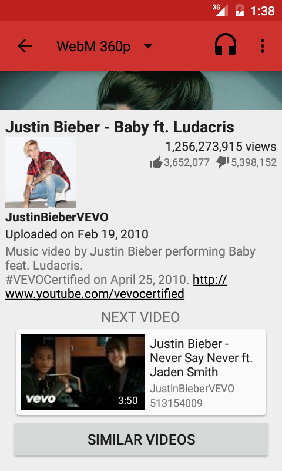

# NewPipe
NewPipe: A free lightweight Youtube frontend for Android.  

Project status:

## Get NewPipe

## Donate

`16A9J59ahMRqkLSZjhYj33n9j3fMztFxnh`

## Screenshots

## Description

NewPipe does not use any Google framework libraries, or the YouTube API. It only parses the website in order to gain the information it needs. Therefore this app can be used on devices without Google Services installed. Also, you don't need a YouTube account to use NewPipe, and it's FLOSS.

### Features

* Search videos
* Display general information about a video
* Watch YouTube videos
* Listen to YouTube videos (experimental)
* Select the streaming player to watch the video with
* Download videos (experimental)
* Download audio only (experimental)
* Open a video in Kodi
* Show Next/Related videos
* Search YouTube in a specific language
* Orbot/Tor support (no streaming yet, experimental)
* Watch age restricted material

### Coming Features

* Improved Downloading
* Bookmarks
* View history
* Search history
* Search channels
* Display general information about channels
* Subscribe to channels
* Watch videos from a channel
* Search/Watch Playlists
* ... and many more

### Multiservice support
Although NewPipe only supports YouTube at the moment, it's designed to support many more streaming services. The plan is, that NewPipe will get such support by the version 2.0.

## Contribution
Whether you have ideas, translation, design changes, code cleaning, or real heavy code changes, help is always welcome.
The more is done the better it gets!

If you'd like to get involved, check our [contribution notes](CONTRIBUTING.md).

## License
  

NewPipe is Free Software: You can use, study share and improve it at your
will. Specifically you can redistribute and/or modify it under the terms of the
[GNU General Public License](https://www.gnu.org/licenses/gpl.html) as
published by the Free Software Foundation, either version 3 of the License, or
(at your option) any later version.  
