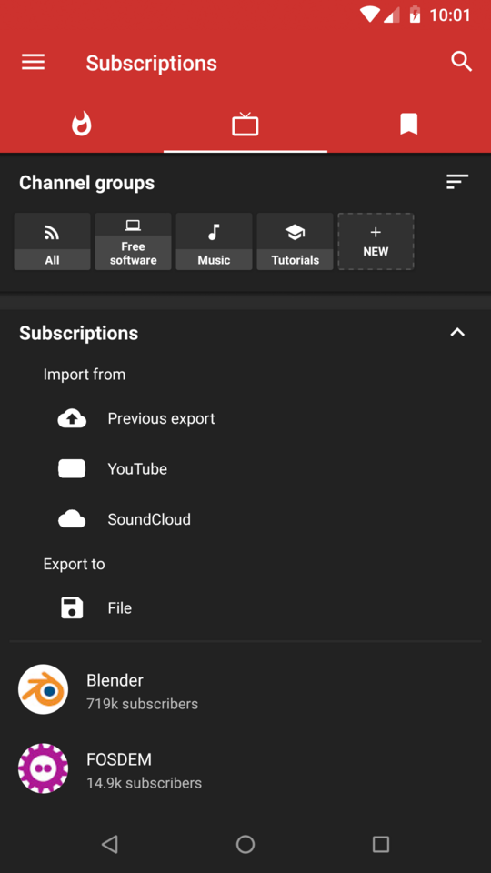
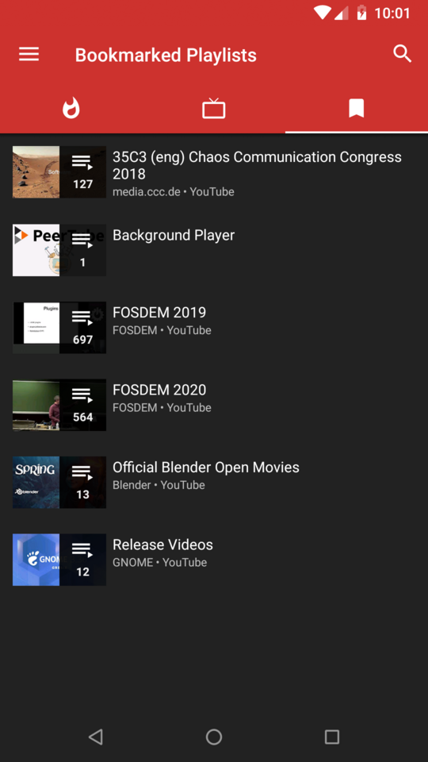
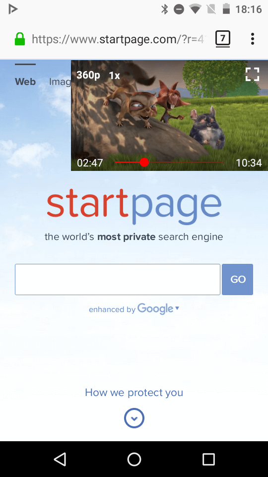
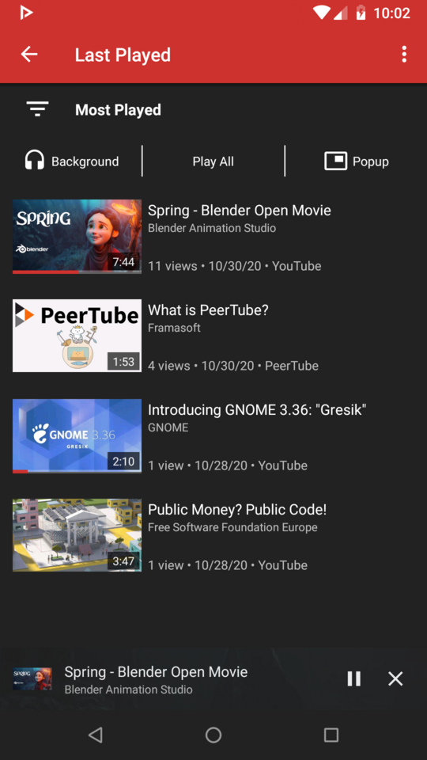
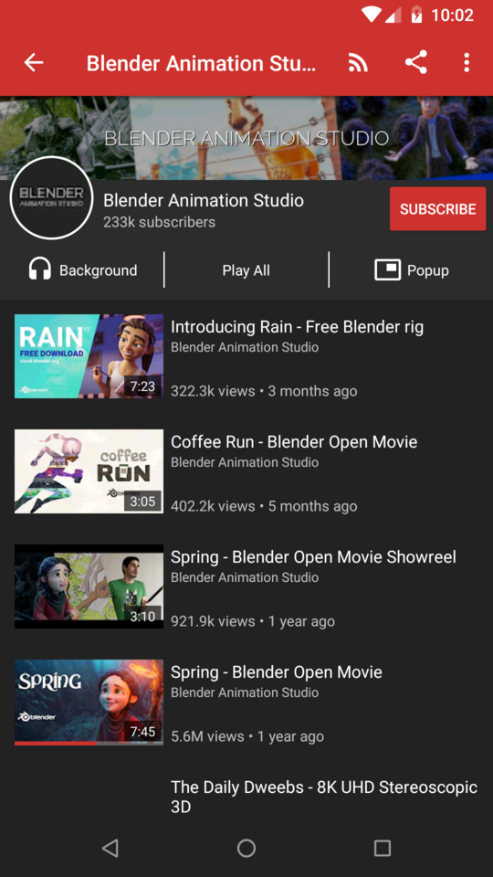
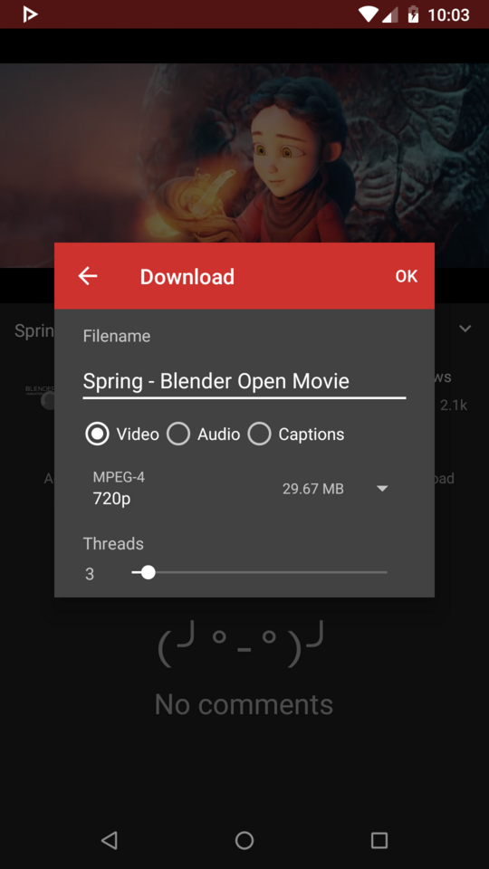
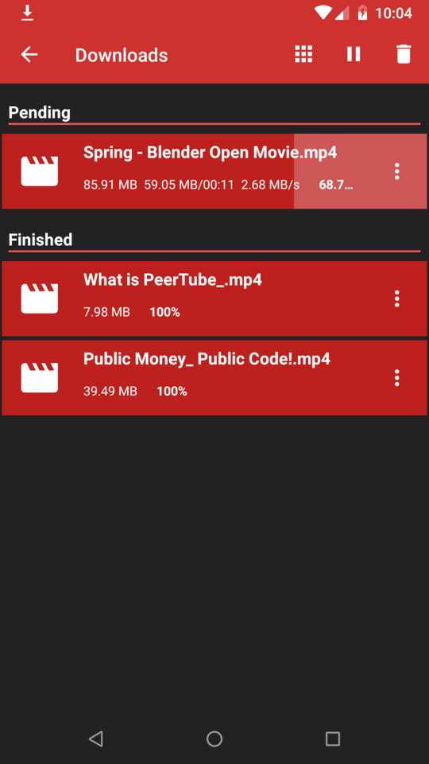
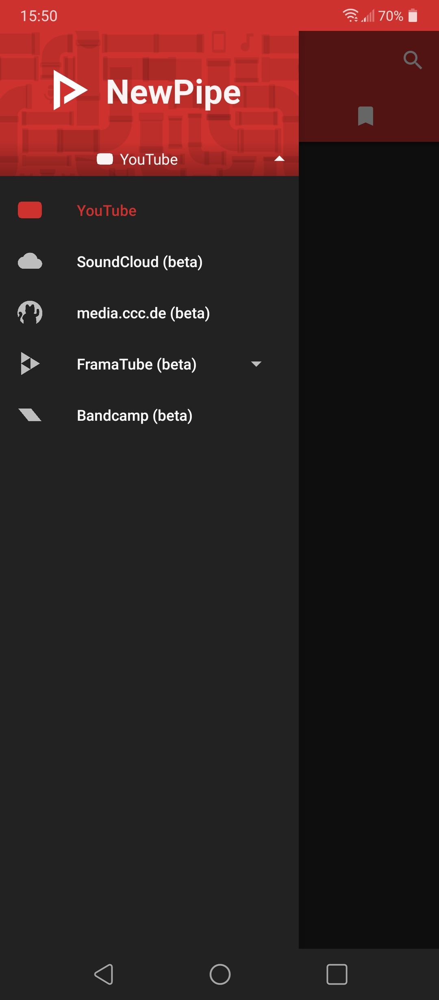
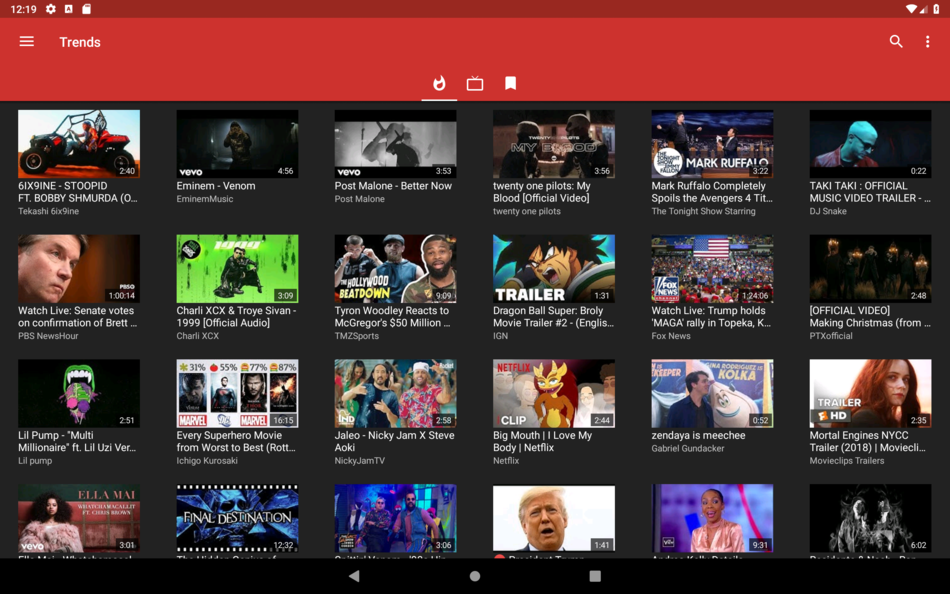
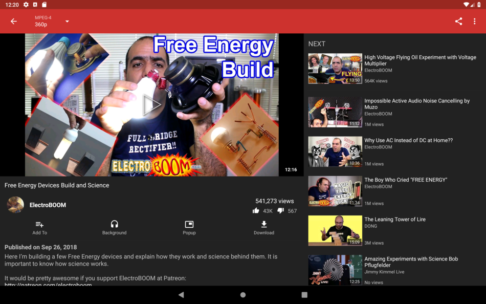

 
<h2 align="center"><b>NewPipe</b></h2>
<h4 align="center">A libre lightweight streaming frontend for Android.</h4>

 

<a href="#screenshots">Screenshots</a> &bull; <a href="#description">Description</a> &bull; <a href="#features">Features</a> &bull; <a href="#updates">Updates</a> &bull; <a href="#contribution">Contribution</a> &bull; <a href="#donate">Donate</a> &bull; <a href="#license">License</a>

<a href="https://newpipe.schabi.org">Website</a> &bull; <a href="https://newpipe.schabi.org/blog/">Blog</a> &bull; <a href="https://newpipe.schabi.org/FAQ/">FAQ</a> &bull; <a href="https://newpipe.schabi.org/press/">Press</a>

<b>WARNING: THIS IS A BETA VERSION, THEREFORE YOU MAY ENCOUNTER BUGS. IF YOU DO, OPEN AN ISSUE VIA OUR GITHUB REPOSITORY.</b>

<b>PUTTING NEWPIPE OR ANY FORK OF IT INTO GOOGLE PLAYSTORE VIOLATES THEIR TERMS OF CONDITIONS.</b>

## Screenshots

## Description

NewPipe does not use any Google framework libraries, nor the YouTube API. Websites are only parsed to fetch required info, so this app can be used on devices without Google services installed. Also, you don't need a YouTube account to use NewPipe, which is copylefted libre software.

### Features

* Search videos
* Display general info about videos
* Watch YouTube videos
* Listen to YouTube videos
* Popup mode (floating player)
* Select streaming player to watch video with
* Download videos
* Download audio only
* Open a video in Kodi
* Show next/related videos
* Search YouTube in a specific language
* Watch/Block age restricted material
* Display general info about channels
* Search channels
* Watch videos from a channel
* Orbot/Tor support (not yet directly)
* 1080p/2K/4K support
* View history
* Subscribe to channels
* Search history
* Search/watch playlists
* Watch as enqueued playlists
* Enqueue videos
* Local playlists
* Subtitles
* Livestream support
* Show comments

### Coming Features

* Cast to UPnP and Cast
* … and many more

### Supported Services

NewPipe supports multiple services. Our [docs](https://teamnewpipe.github.io/documentation/) provide more info on how a new service can be added to the app and the extractor. Please get in touch with us if you intend to add a new one. Currently supported services are:

* YouTube
* SoundCloud \[beta\]
* media.ccc.de \[beta\]
* PeerTube instances \[beta\]

## Updates
When a change to the NewPipe code occurs (due to either adding features or bug fixing), eventually a release will occur. These are in the format x.xx.x . In order to get this new version, you can:
 * Build a debug APK yourself. This is the fastest way to get new features on your device, but is much more complicated, so we recommend using one of the other methods.
 * Download the APK from [releases](https://github.com/TeamNewPipe/NewPipe/releases) and install it.
 * Update via F-droid. This is the slowest method of getting updates, as F-Droid must recognize changes, build the APK itself, sign it, then push the update to users.

When you install an APK from one of these options, it will be incompatible with an APK from one of the other options. This is due to different signing keys being used. Signing keys help ensure that a user isn't tricked into installing a malicious update to an app, and are independent. F-Droid and GitHub use different signing keys, and building an APK debug excludes a key. The signing key issue is being discussed in issue [#1981](https://github.com/TeamNewPipe/NewPipe/issues/1981), and may be fixed by setting up our own repository on F-Droid.

In the meanwhile, if you want to switch sources for some reason (e.g. NewPipe's core functionality was broken and F-Droid doesn't have the update yet), we recommend following this procedure:
1. Back up your data via "Settings>Content>Export Database" so you keep your history, subscriptions, and playlists
2. Uninstall NewPipe
3. Download the APK from the new source and install it
4. Import the data from step 1 via "Settings>Content>Import Database"

## Contribution
Whether you have ideas, translations, design changes, code cleaning, or real heavy code changes, help is always welcome.
The more is done the better it gets!

If you'd like to get involved, check our [contribution notes](.github/CONTRIBUTING.md).

## Donate
If you like NewPipe we'd be happy about a donation. You can either send bitcoin or donate via Bountysource or Liberapay. For further info on donating to NewPipe, please visit our [website](https://newpipe.schabi.org/donate).

<table>
  <tr>
    <td></td>
    <td></td>
    <td><samp>16A9J59ahMRqkLSZjhYj33n9j3fMztFxnh</samp></td>
  </tr>
  <tr>
    <td></td>
    <td></td>
    <td></td>
  </tr>
  <tr>
    <td></td>
    <td></td>
    <td></td>
  </tr>
</table>

## Privacy Policy

The NewPipe project aims to provide a private, anonymous experience for using media web services.
Therefore, the app does not collect any data without your consent. NewPipe's privacy policy explains in detail what data is sent and stored when you send a crash report, or comment in our blog. You can find the document [here](https://newpipe.schabi.org/legal/privacy/).

## License
  

NewPipe is Free Software: You can use, study share and improve it at your
will. Specifically you can redistribute and/or modify it under the terms of the
[GNU General Public License](https://www.gnu.org/licenses/gpl.html) as
published by the Free Software Foundation, either version 3 of the License, or
(at your option) any later version.  
