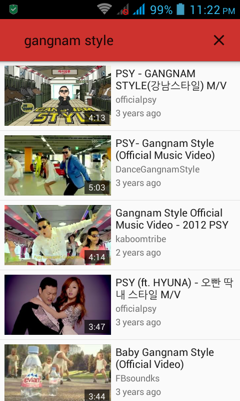
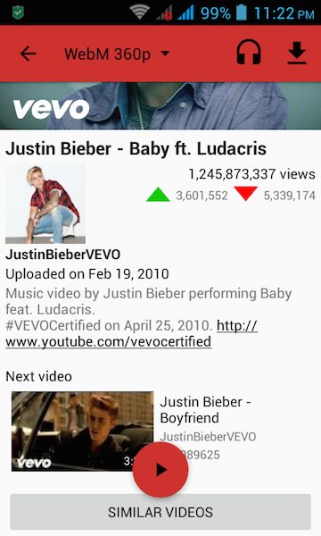

# NewPipe

A free lightweight YouTube frontend for Android

## Description

NewPipe does not use any Google framework libraries, or the YouTube API. It only parses the website in order to gain the information it needs. Therefore this app can be used on devices without Google Services installed. Also, you don't need a YouTube account to use NewPipe, and it's FLOSS.

## Features

* Search videos
* Display general information about a video
* Watch YouTube videos
* Listen to YouTube videos (audio only streaming)
* Select the streaming player to watch the video with
* Download videos (working, but it could be better)
* Download audio only (working, but it could be better)
* Open a video in Kodi
* Show Next/Related videos
* Search YouTube in a specific language

### Coming Features

* Improved Downloading
* Bookmarks
* View history
* Search history
* Search channels
* Display general information about channels
* Subscribe to channels
* Watch videos from a channel
* Search/Watch Playlists
* ... and many more

### Multiservice support
Although, right now NewPipe supports only YouTube, it's designed to support many more streaming services. The plan is, that NewPipe will get such support by the v2.0.

## Contribution
Whether it's ideas, translation, design changes, code cleaning, or real heavy code changes, help is always welcome.
The more is done the better it gets!

Join our discussion on slack: http://invite.chschtsch.ml/

## License
NewPipe is licensed under [GNU General Public License v3](LICENSE).
