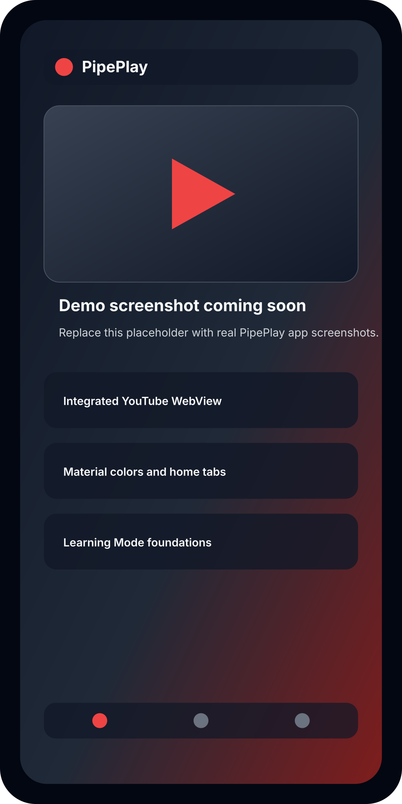

<div align="center">
  

  <h1>PipePlay</h1>

  <p>
    <strong>Privacy-friendly streaming for Android with native playback, WebView fallback, learning tools, and a clean home screen.</strong>
  </p>

  <p>
    <a href="../../releases"><strong>⬇️ Download APK</strong></a><br>
    <a href="#-screenshots">Screenshots</a> ·
    <a href="#-features">Features</a> ·
    <a href="#-download">Download</a> ·
    <a href="#%EF%B8%8F-building-from-source">Build</a>
  </p>

  <p>
    <a href="https://www.gnu.org/licenses/gpl-3.0"></a>
    <a href="../../actions/workflows/ci.yml"></a>
    <a href="../../releases"></a>
  </p>
</div>

---

## ✨ Why PipePlay?

PipePlay is for people who want a lightweight streaming experience without accounts, tracking-heavy SDKs, or unnecessary clutter. It keeps the familiar NewPipe-style workflow and adds practical upgrades for modern Android use.

> **▶️ Watch your way**<br>
> Main, background, and popup playback, plus an integrated YouTube WebView fallback for difficult videos.

> **🧭 Make home yours**<br>
> Configure home tabs, use bottom navigation for compact setups, or switch to scrollable tabs for larger setups.

> **🎓 Learn while watching**<br>
> Learning Mode foundations for timestamped notes, study sessions, playlist progress, and a dashboard.

> **🔐 Privacy-first defaults**<br>
> No Google Play Services requirement. Subscriptions, playlists, history, and settings stay local unless you opt into specific features.

---

## 📸 Screenshots

Real PipePlay screenshots will be added soon. This placeholder keeps the README ready for final app screenshots.

<div align="center">
  
  <br>
  <sub>Replace with real screenshots in <code>assets/screenshots/</code>.</sub>
</div>

---

## 🚀 Features

### ▶️ Playback and WebView

- Integrated YouTube WebView screen.
- Manual **Open in WebView** action from video details and supported share-intent flows.
- Optional fallback to WebView when native YouTube extraction fails.
- Optional **Prefer WebView for playback** mode.
- Optional hidden WebView sync to register watch history on YouTube’s side.
- Main, background, and popup playback inherited from the NewPipe/PipePipe ecosystem.

### 🧭 Home, navigation, and appearance

- Configurable **Content of main page** tabs.
- Add YouTube WebView, YouTube Music, YouTube Shorts, Learning, subscriptions, feed, bookmarks, history, channels, and playlists as home tabs.
- Material dynamic colors on supported Android versions.
- Manual color presets.
- Bottom navigation for 2–5 home tabs, with automatic scrollable-tab fallback for larger setups.

### 🔎 Discovery and metadata

- YouTube URL normalization for common URL variants:
  - `m.youtube.com`
  - `youtu.be`
  - `music.youtube.com`
  - `youtube.com/shorts/...`
  - `youtube-nocookie.com`
- YouTube dislike-count support using Return YouTube Dislike.
- SponsorBlock integration inherited from the target client.
- DeArrow title and thumbnail support on YouTube video detail pages.

### 🎓 Learning Mode

- Learning Mode settings.
- Timestamped note model and note dialog foundation.
- Study-session database foundation.
- Lightweight Learning dashboard tab.
- Playlist progress helper foundation.

---

## 📦 Download

Release APKs are published through GitHub Releases when release tags are pushed.

<div align="center">
  <a href="../../releases"><strong>➡️ Download the latest release</strong></a>
</div>

Development APKs are available from GitHub Actions artifacts when CI runs are enabled.

---

## 🛠️ Building from source

This repository layout expects:

- Android client: `PipePipeClient-dev`
- Extractor composite build: `PipePipeExtractor` next to `PipePipeClient-dev`

```bash
git clone <this-repository>
cd <this-repository>

# Ensure PipePipeExtractor exists next to PipePipeClient-dev.
cd PipePipeClient-dev
./gradlew assembleDebug
```

Release signing uses these environment variables:

- `KEY_PATH` — path to release keystore
- `KEY_STORE_PASSWORD` — keystore password
- `KEY_ALIAS` — signing key alias
- `KEY_PASSWORD` — signing key password

The GitHub release workflow also supports a base64-encoded keystore secret named `ANDROID_KEYSTORE_BASE64`.

---

## 📌 Project notice

PipePlay is an independent Android streaming client derived from the NewPipe/PipePipe ecosystem.

PipePlay is not affiliated with, sponsored by, or endorsed by YouTube, Google, NewPipe, PipePipe, or their maintainers. Upstream projects and third-party libraries remain credited under their respective licenses.

---

## ⚖️ Upstream and license

PipePlay is based on GPLv3 NewPipe/PipePipe-derived code and preserves upstream licensing obligations.

- License: GPLv3 or later.
- Upstream credits remain in source files, assets, and app notices where applicable.
- Third-party services and integrations are subject to their own terms and availability.

<div align="center">
  <sub>Built for a cleaner, calmer, more personal streaming experience.</sub>
</div>
