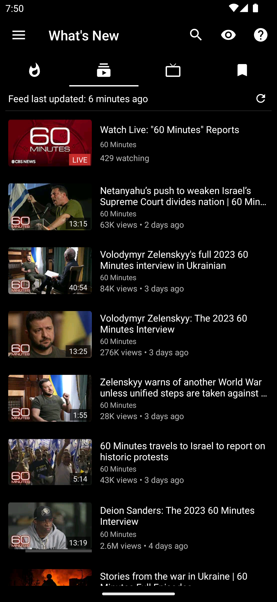
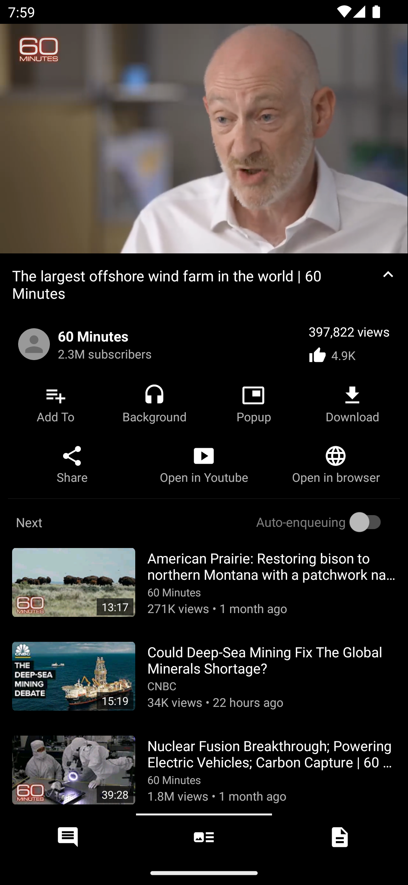
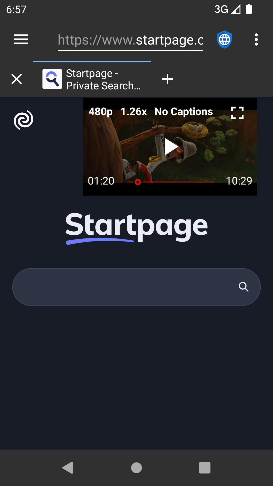
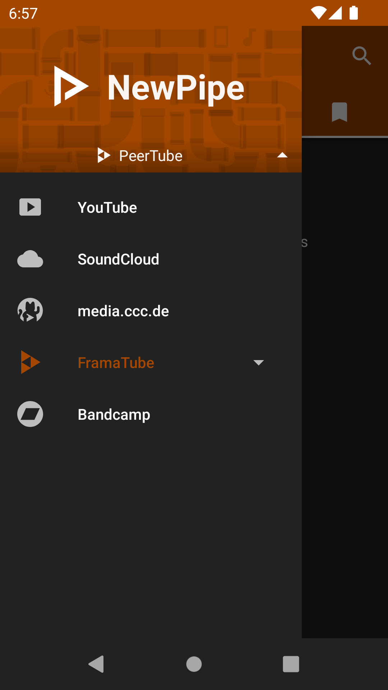
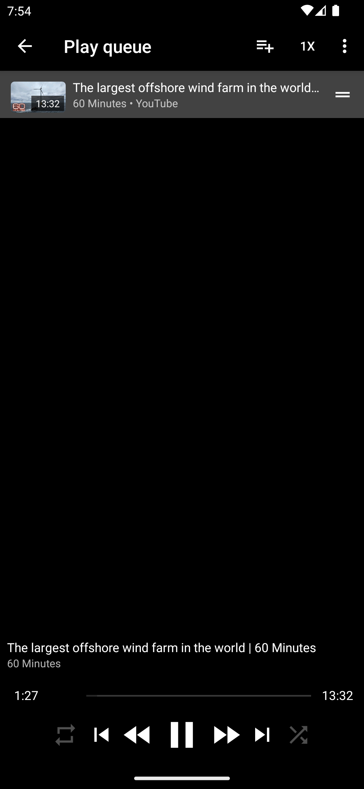
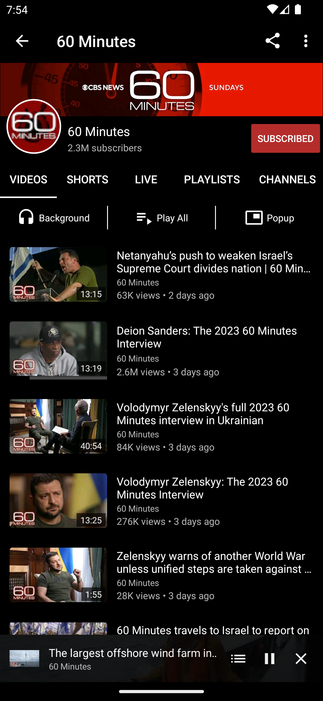
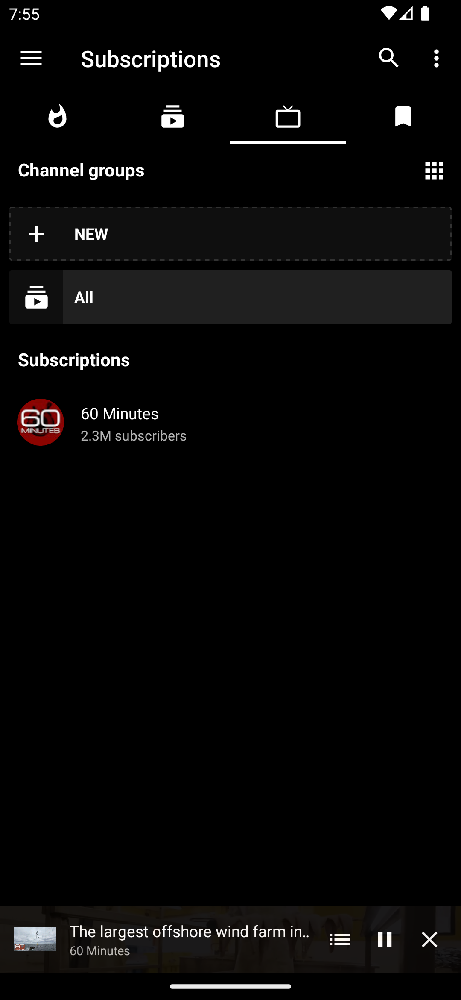
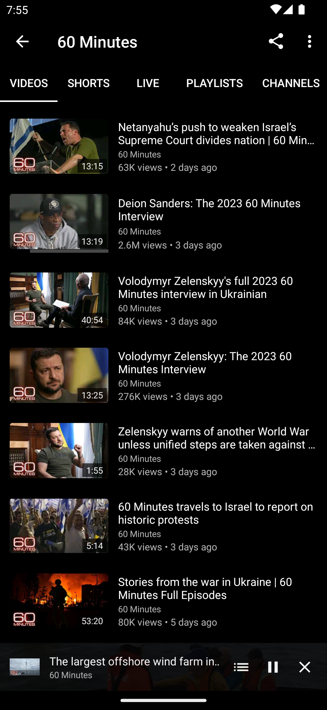
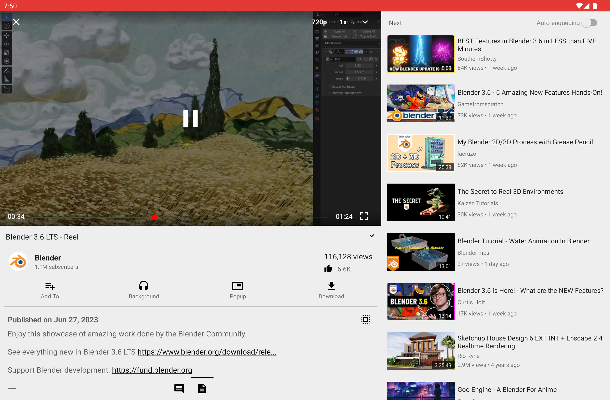
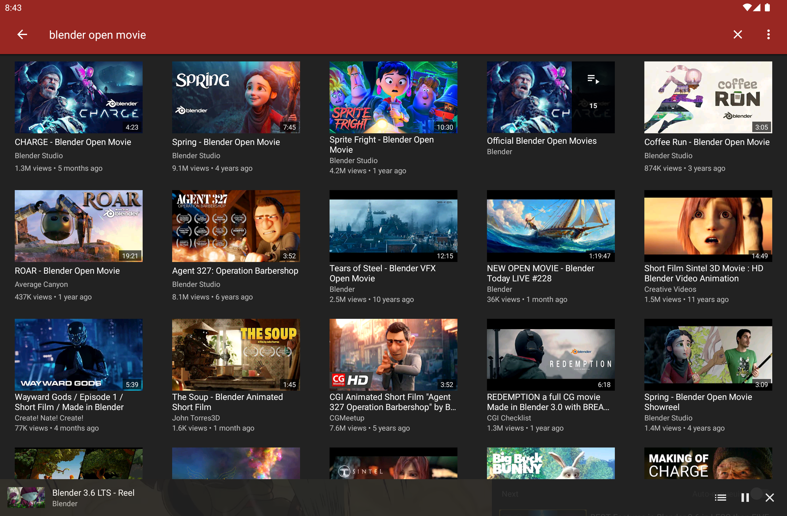

 
<h2 align="center"><b>NewPipe</b></h2>
<h4 align="center">Android için hafif ve özgür bir akış arayüzü.</h4>

<a href="#ekran-fotoğrafları">Ekran fotoğrafları</a> &bull; <a href="#açıklama">Açıklama</a> &bull; <a href="#özellikler">Özellikler</a> &bull; <a href="#kurulum-ve-güncellemeler">Kurulum ve güncellemeler</a> &bull; <a href="#katkıda-bulunma">Katkıda bulunma</a> &bull; <a href="#bağış">Bağış</a> &bull; <a href="#lisans">Lisans</a>

<a href="https://newpipe.net">Web sitesi</a> &bull; <a href="https://newpipe.net/blog/">Blog</a> &bull; <a href="https://newpipe.net/FAQ/">SSS</a> &bull; <a href="https://newpipe.net/press/">Basın</a>

*Read this document in other languages: [Deutsch](README.de.md), [English](../README.md), [Español](README.es.md), [Français](README.fr.md), [हिन्दी](README.hi.md), [Italiano](README.it.md), [한국어](README.ko.md), [Português Brasil](README.pt_BR.md), [Polski](README.pl.md), [ਪੰਜਾਬੀ ](README.pa.md), [日本語](README.ja.md), [Română](README.ro.md), [Soomaali](README.so.md), [Türkçe](README.tr.md), [正體中文](README.zh_TW.md), [অসমীয়া](README.asm.md), [うちなーぐち](README.ryu.md), [Српски](README.sr.md)*

<b>UYARI: BU SÜRÜM BETA SÜRÜMÜDÜR, BU NEDENLE HATALARLA KARŞILAŞABİLİRSİNİZ. HATA BULURSANIZ BU GITHUB DEPOSUNDA BUNU BİLDİRİN.</b>

<b>GOOGLE PLAY STORE'A NEWPIPE VEYA BAŞKA BİR KOPYASINI KOYMAK, PLAY STORE ŞARTLARINI VE KOŞULLARINI İHLAL EDER.</b>

## Ekran görüntüleri

  

## Açıklama

NewPipe herhangi bir Google çerçeve kütüphanesini, ya da YouTube API hizmetlerini kullanmaz. Gerekli web hizmetleri yalnızca gerekli bilgileri almak için kaynak olarak kullanılır, bu nedenle bu uygulama Google hizmetleri yüklü olmayan cihazlarda da kullanılabilir. Ayrıca, copyleft özgür yazılımı olan NewPipe'ı kullanmak için bir YouTube hesabına ihtiyacınız yoktur.

### Özellikler

* Video arama
* Videolar hakkında genel bilgileri görüntüleme
* YouTube videoları izleme
* YouTube videolarını dinleme
* Pop-up modu (hareketli oynatıcı)
* Video izlemek için akış oynatıcısını seçme
* Video indirme
* Sadece ses indirme
* Videoyu Kodi'de açma
* Sonraki video/ilgili videolar
* YouTube'u belirli bir dilde arayın
* Yaş sınırlı içeriği izleme/engelleme
* Kanallar hakkındaki genel bilgileri görüntüleme
* Kanal arama
* Bir kanaldaki videoları izleme
* Orbot/Tor desteği (henüz direkt olarak değil)
* 1080p/2K/4K desteği
* Geçmişi görme
* Kanallara abone olma
* Geçmişte arama
* Oynatma listesi arama/oynatma
* Çalma listelerini sıralayıp oynatın
* Videoları sırayla oynatın
* Yerel oynatma listeleri
* Altyazılar
* Canlı yayın desteği
* Yorumları görme

### Desteklenen servisler

NewPipe birden fazla hizmeti destekler. Uygulamaya ve ayıklayıcıya yeni bir hizmet ekleme konusunda daha fazla bilgiye [kılavuzlarımızdan](https://teamnewpipe.github.io/documentation/) ulaşabilirsiniz. Yeni bir hizmet eklemek istiyorsanız lütfen bizimle iletişime geçin. Şu anda desteklenen hizmetler şunlardır:

* YouTube
* SoundCloud \[beta\]
* media.ccc.de \[beta\]
* PeerTube \[beta\]
* Bandcamp \[beta\]

<!-- Eski bağlantıları uyumlu tutmak için gizli span. -->

## Kurulum ve güncellemeler
Aşağıdaki yöntemlerden birini kullanarak NewPipe'ı kurabilirsiniz:
 1. Özel depomuzu F-Droid'e ekleyin ve oradan yükleyin. Kılavuzu şurada bulabilirsiniz: https://newpipe.net/FAQ/tutorials/install-add-fdroid-repo/
 2. APK'yı [GitHub sürümlerinden](https://github.com/TeamNewPipe/NewPipe/releases) indirin ve kurun.
 3. F-Droid ile güncelleyin. Bu, güncellemeleri almanın en yavaş yöntemidir, çünkü F-Droid değişiklikleri tanımalı, APK'yı kendisi oluşturmalı, imzalamalı ve ardından güncellemeyi kullanıcılara dağıtmalıdır.
 4. Kendiniz bir APK derleyin. Bu yöntem, cihazınızda yeni özellikler edinmenin en hızlı yoludur, ancak çok daha karmaşıktır, bu nedenle diğer yöntemlerden birini kullanmanızı öneririz.

Çoğu kullanıcı için yöntem 1'i öneririz. Yöntem 1 veya 2 kullanılarak yüklenen APK'lar birbiriyle uyumludur, ancak yöntem 3 kullanılarak yüklenenlerle uyumlu değildir. Bu durum, 1 ve 2 için kullanılan aynı imzalama anahtarıın (bizim anahtarımız) 3 için kullanılan imzalama anahtarından (F-Droid'in anahtarı) farklı olmasından kaynaklanmaktadır. Yöntem 4 kullanılarak oluşturulan deneysel APK'larda anahtar yoktur. İmzalama anahtarları, bir kullanıcının bir uygulamaya kötü amaçlı bir güncelleme yüklemek için kandırılmadığından emin olmanıza yardımcı olur.

Bu arada, herhangi bir nedenle kaynakları değiştirmek istiyorsanız (örneğin, NewPipe'ın temel bir işlevi bozuldu ve F-Droid tarafında henüz bir güncelleme yayınlanmadı), bu prosedürü izlemenizi öneririz:
1. Verilerinizi yedekleyin. `NewPipe Ayarları > İçerik > Veritabanını dışa aktar` seçeneklerini izleyerek aboneliklerinizi, oynatma listelerinizi ve geçmişinizi yedekleyin.
2. NewPipe'ı kaldırın
3. APK dosyasını yeni bir kaynaktan indirin ve yükleyin
4. `Ayarlar > İçerik > Veritabanını içe aktar` seçeneklerini izleyerek 1. adımdaki verileri içe aktarın

## Katkıda bulunma
Fikirleriniz, çevirileriniz, tasarım değişiklikleriniz, kod temizlemeniz veya ağır kod değişiklikleriniz olsun, yardımınıza her zaman açığız.
Yapılan her değişiklikle NewPipe daha da iyi bir konuma geliyor!

Eğer yer almak istiyorsanız, [katkı sağlayanlar için hazırladığımız notları](../.github/CONTRIBUTING.md) kontrol edin.

## Bağış
NewPipe'ı beğendiyseniz, yapacağınız bağışlar bizi motive eder. Bitcoin gönderebilir veya Bountysource veya Liberapay aracılığıyla bağış yapabilirsiniz. NewPipe'a bağış yapma hakkında daha fazla bilgi için lütfen [web sitemizi](https://newpipe.net/donate) ziyaret edin.

<table>
  <tr>
    <td></td>
    <td></td>
    <td></td>
  </tr>
</table>

## Gizlilik politikası

NewPipe projesi, çevrimiçi akış hizmetlerini kullanmak için özel, özgür ve anonim bir deneyim sunmayı amaçlamaktadır.
Bu doğrultuda, uygulama sizin izniniz olmadan herhangi bir veri toplamaz. NewPipe'ın Gizlilik Politikası, bir çökme raporu gönderdiğinizde veya blogumuzda yorum yaptığınızda hangi verilerin gönderildiğini ve saklandığını ayrıntılı olarak açıklar. İlgili belgeyi [burada](https://newpipe.net/legal/privacy/) bulabilirsiniz.

## Lisans
  

NewPipe özgür bir yazılımdır. Kendi başınıza kullanabilir, öğrenebilir, paylaşabilir
ve geliştirebilirsiniz. Free Software Foundation tarafından yayınlanan GNU Genel Kamu Lisansı,
Lisansın 3. sürümü veya (isteğe bağlı olarak) daha sonraki bir sürümü şartları ve
koşulları altında yeniden dağıtabilir ve/veya değiştirebilirsiniz.
