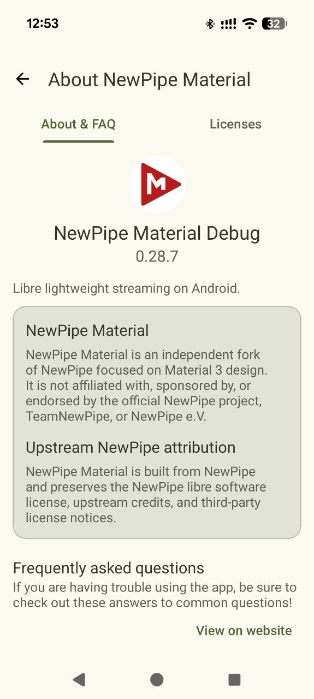
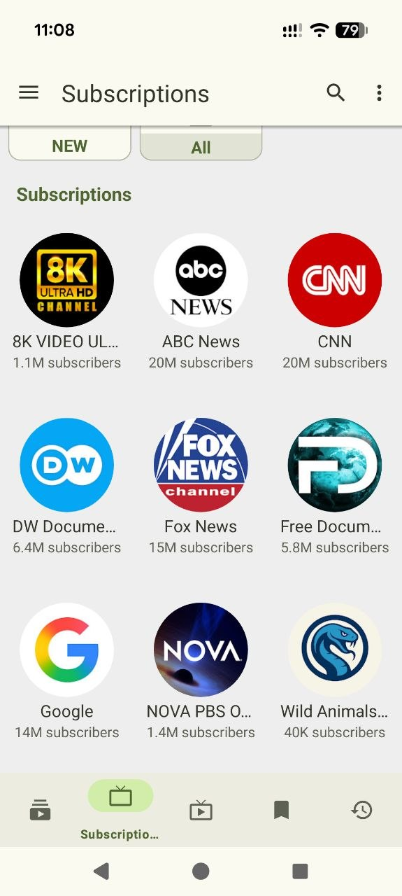
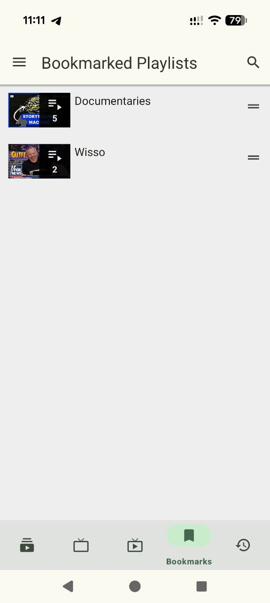
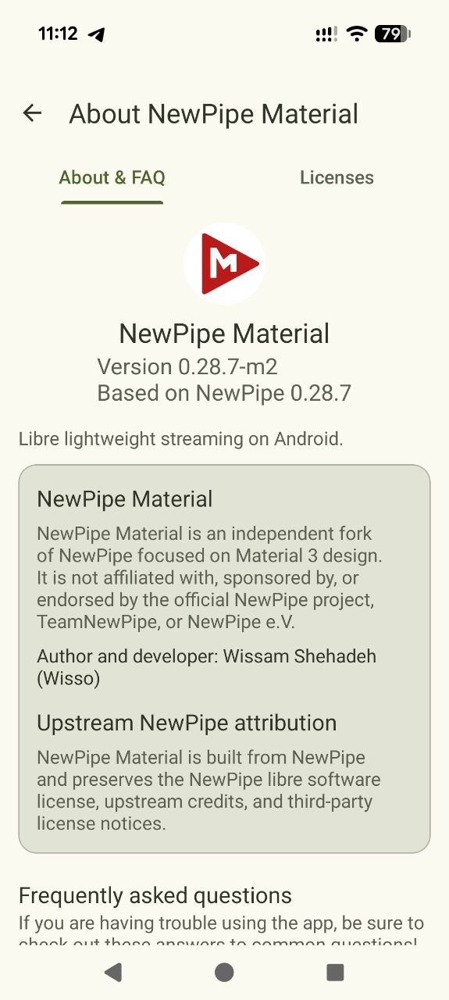
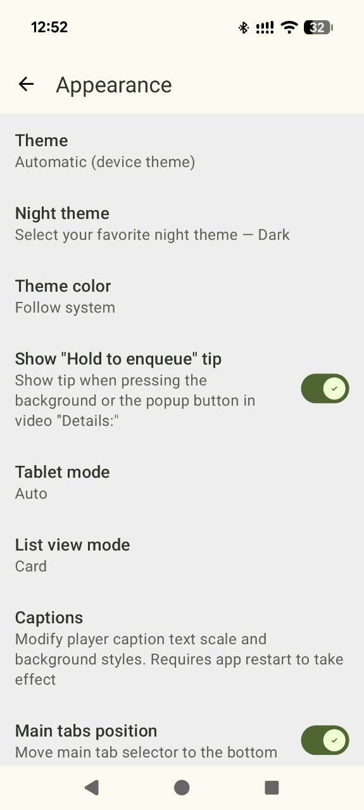
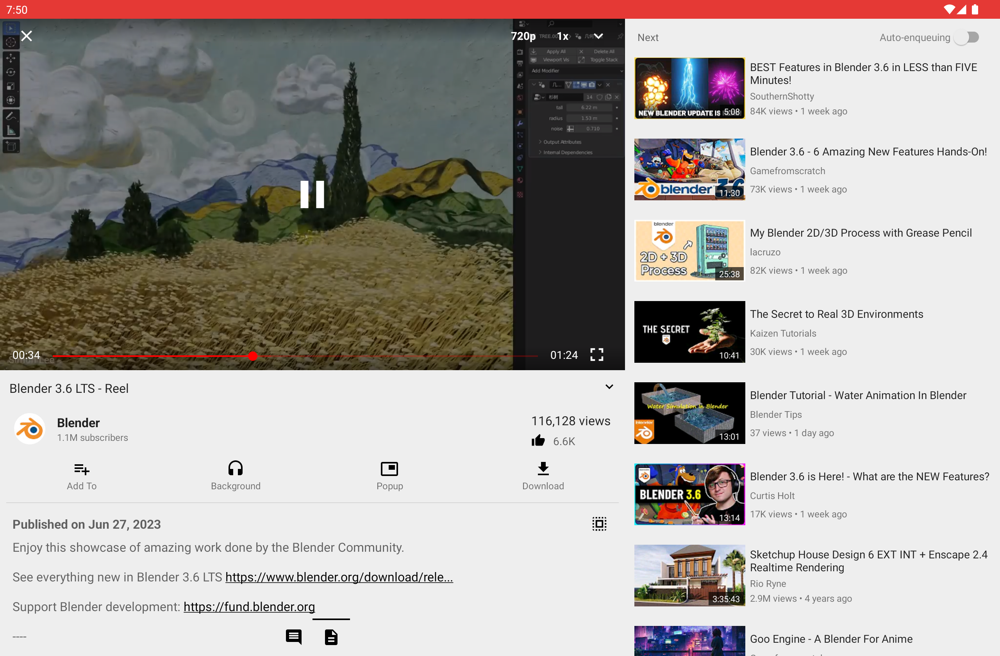
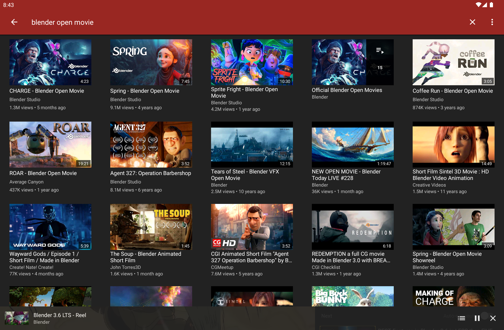

<p align="center"><a href="https://github.com/wizdom13/NewPipe_Material"></a></p>

<h1 align="center">NewPipe Material</h1>

<p align="center"><b>以 Material 3 為重點的 Android NewPipe 獨立分支。</b></p>

<p align="center">
  <a href="https://www.gnu.org/licenses/gpl-3.0"></a>
  <a href="https://github.com/wizdom13/NewPipe_Material/actions"></a>
</p>

<p align="center"><b>其他語言：</b> <a href="../README.md">English</a> &bull; <a href="README.de.md">Deutsch</a> &bull; <a href="README.es.md">Español</a> &bull; <a href="README.fr.md">Français</a> &bull; <a href="README.hi.md">हिन्दी</a> &bull; <a href="README.it.md">Italiano</a> &bull; <a href="README.ko.md">한국어</a> &bull; <a href="README.pt_BR.md">Português Brasil</a> &bull; <a href="README.pl.md">Polski</a> &bull; <a href="README.pa.md">ਪੰਜਾਬੀ</a> &bull; <a href="README.ja.md">日本語</a> &bull; <a href="README.ro.md">Română</a> &bull; <a href="README.ru.md">Русский</a> &bull; <a href="README.so.md">Soomaali</a> &bull; <a href="README.tr.md">Türkçe</a> &bull; <a href="README.zh_TW.md">正體中文</a> &bull; <a href="README.ryu.md">沖縄口</a> &bull; <a href="README.asm.md">অসমীয়া</a> &bull; <a href="README.sr.md">Српски</a> &bull; <a href="README.ar.md">العربية</a></p>

---

## 重要分支聲明

NewPipe Material 是獨立維護的 NewPipe 分支，專注於 Material 3 設計、應用程式主題與產品細節打磨。

本專案**未隸屬、未受贊助，也未獲官方 NewPipe 專案、TeamNewPipe 或 NewPipe e.V. 背書**。

NewPipe Material 基於 NewPipe，並保留 NewPipe 的自由軟體授權、上游致謝與第三方授權聲明。

---

## NewPipe Material 是什麼？

NewPipe Material 保留 NewPipe 的核心體驗，同時現代化應用程式識別與使用者介面。

目前目標：

- 受 Material 3 啟發的介面、對話框、設定、分頁與導覽
- 在可用裝置上支援 Material You 動態色彩
- 手動主題色彩：App default、Neutral、Green、Blue、Purple、Orange、Pink、Red
- 新的應用程式識別：**NewPipe Material**
- 獨立 application ID：`org.wisso.newpipematerial`
- debug build 會以 `org.wisso.newpipematerial.debug` 另外安裝
- 保留 NewPipe 行為、匯入/匯出相容性與支援服務

本分支會避免在播放、下載、背景播放、彈出播放器與 Extractor 邏輯等敏感區域做高風險行為變更，除非這些變更是專門規劃並經過測試的工作。

---

## 截圖

### Phone

<p align="center">
  <a href="../fastlane/metadata/android/en-US/images/phoneScreenshots/01.png"></a>
  <a href="../fastlane/metadata/android/en-US/images/phoneScreenshots/02.png"></a>
  <a href="../fastlane/metadata/android/en-US/images/phoneScreenshots/03.png"></a>
  <a href="../fastlane/metadata/android/en-US/images/phoneScreenshots/04.png"></a>
  <a href="../fastlane/metadata/android/en-US/images/phoneScreenshots/05.png"></a>
  <a href="../fastlane/metadata/android/en-US/images/phoneScreenshots/06.png"></a>
  <a href="../fastlane/metadata/android/en-US/images/phoneScreenshots/07.png"></a>
  <a href="../fastlane/metadata/android/en-US/images/phoneScreenshots/08.png"></a>
  <a href="../fastlane/metadata/android/en-US/images/phoneScreenshots/09.png"></a>
</p>

### Tablet

<p align="center">
  <a href="../fastlane/metadata/android/en-US/images/tenInchScreenshots/09.png"></a>
  <a href="../fastlane/metadata/android/en-US/images/tenInchScreenshots/10.png"></a>
</p>

---

## 支援服務

NewPipe Material 繼承 NewPipe 對 YouTube、YouTube Music、PeerTube、Bandcamp、SoundCloud 與 media.ccc.de 的支援。

---

## 功能

NewPipe Material 保留 NewPipe 熟悉的功能：觀看影片與直播、背景播放、彈出播放器、本機播放清單、無平台帳號訂閱、頻道群組、搜尋、影片詳細資訊、下載與資料匯入/匯出。

Material 相關新增內容包含 Material 3 色彩角色、五個或更少主分頁時的底部導覽、動態/手動主題色彩、About 畫面的分支歸屬說明，以及 release signing 支援。

---

## 安裝

請從本 repository 的 GitHub Releases 或可用的已簽署 artifacts 安裝 NewPipe Material。
Releases: https://github.com/wizdom13/NewPipe_Material/releases

```text
Official NewPipe: org.schabi.newpipe / net.newpipe.app 視 upstream build 而定
NewPipe Material: org.wisso.newpipematerial
Debug:            org.wisso.newpipematerial.debug
```

要遷移資料，請在官方 NewPipe 的 Settings > Backup and Restore 匯出 database，安裝 NewPipe Material 後再匯入備份。請務必保留備份。

不要將 NewPipe Material、NewPipe 或 NewPipe 分支發布到 Google Play。

---

## 從原始碼建置

需求：JDK 21、Android SDK、repository 內的 Gradle wrapper。

```bash
./gradlew runCheckstyle -DskipFormatKtlint
./gradlew assembleDebug lintDebug testDebugUnitTest --stacktrace -DskipFormatKtlint
./gradlew assembleDebug -DskipFormatKtlint
```

Debug build 使用 **NewPipe Material Debug** 名稱與 `org.wisso.newpipematerial.debug` package。

---

## Release signing

```text
NEWPIPE_MATERIAL_RELEASE_STORE_FILE
NEWPIPE_MATERIAL_RELEASE_STORE_PASSWORD
NEWPIPE_MATERIAL_RELEASE_KEY_ALIAS
NEWPIPE_MATERIAL_RELEASE_KEY_PASSWORD
```

---

## 開發狀態

已完成或進行中：app name 與 ID、debug/release identity separation、Material 3 colors、dynamic/manual colors、bottom navigation、About screen、dialogs、snackbars、settings、video detail、download UI、signing workflow。

延後或高風險：main player overlay、seekbar/gesture colors、queue controls、quality/audio/caption menus，以及廣泛的 playback/download behavior changes。

---

## 貢獻

歡迎 bug fixes、QA、documentation、release readiness 與 focused Material 3 polish。請讓變更保持聚焦且可測試。

---

## Upstream NewPipe

- NewPipe repository: https://github.com/TeamNewPipe/NewPipe
- NewPipe website: https://newpipe.net
- NewPipe FAQ: https://newpipe.net/FAQ/
- NewPipe Extractor: https://github.com/TeamNewPipe/NewPipeExtractor

分支特有問題請回報到本 repository。Service 或 Extractor 問題可能需要與官方 NewPipe 比較。

---

## Donate

支援 upstream NewPipe：https://newpipe.net/donate

NewPipe Material 是獨立分支；upstream donations 會給 upstream NewPipe project，不會自動給此分支。

---

## License

NewPipe Material 是基於 NewPipe 的 free software，依 GNU General Public License version 3 或更新版本散布。完整資訊請查看 repository license files 與 app 內 license screen。
